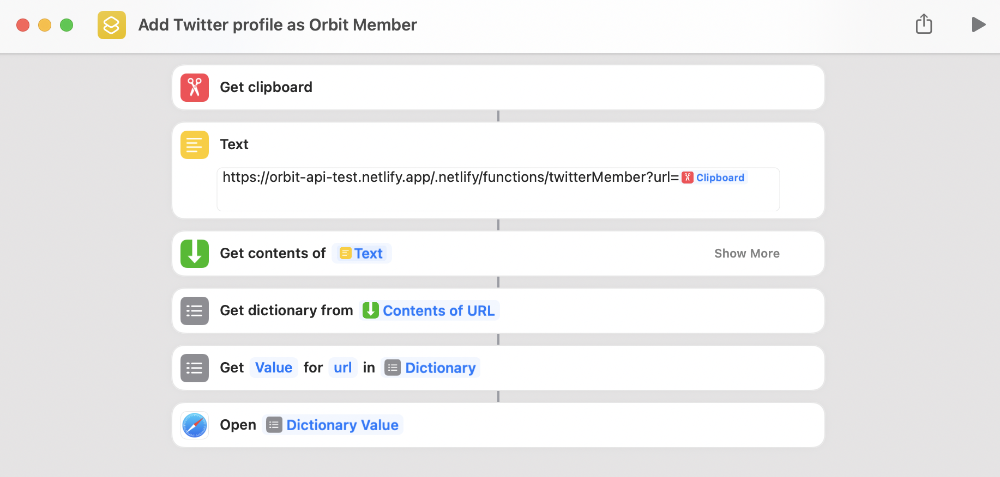

# Save a Twitter Profile to Orbit as a Member

This is a proof of concept repository for a serverless function that accepts a Twitter URL and adds that person to an [Orbit](https://orbit.love) Workspace as a member.

## Requirements

* A place to host the function. This proof of concept uses Netlify functions
* [Orbit API key](https://docs.orbit.love/reference/authorization)
* Orbit workspace

## Environment variables

|Key|Value|
|--|----|
|ORBIT_WORKSPACE| *string* Orbit workspace ID | 
|ORBIT_API_KEY| *string* Orbit API key|

## Setting up an Apple Shortcut

This proof of concept operates under the assumption of as little interaction as possible. For those on MacOS or iOS, an Apple Shortcut can be used. 

The Shortcut can be initiated from the menu bar on MacOS and the "Share sheet" on iOS. On desktop, a Twitter URL should be copied and stored in the user's clipboard and then the Shortcut can be run.

On iOS, using the "Share sheet" on a Twitter profile page will send the URL to the function.

The Shortcut receives a Twitter profile URL and send it to the serverless function. The serverless function adds the profile as a Twitter identity in Orbit and returns a success message and a URL in an object. That object is used by Shortcuts to open a browser window with the newly created or updated Member in Orbit.

## Non-Apple usage

Since this is a serverless function, any method that can send a Twitter profile URL as a query parameter to the serverless function can make this work. This could be crafted into a JS bookmarklet to be used in other OSes.